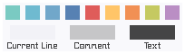
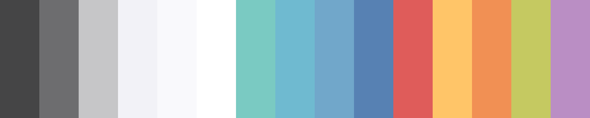

     

---

# 1.0.1 (2016-05-06)
## Bug Fixes
### LESSCSS
  - Fixed a missing colon of the `@rgb-dark-snow` color variable (@zhrkevin, [GHI #6][ghi-6-arcticicestudio-northem-light-atom-syntax])
  - Removed leading whitespaces infront of the HEX and RGB color variables

# 1.0.0 (2016-04-16)

**Syntax Preview**  

## Features
### Native
  - Added the "[GIMP](https://www.gimp.org)/[Inkscape](https://inkscape.org) Palette" file format (`.gpl`)
  - Added the "[Adobe Swatch Exchange](https://helpx.adobe.com/illustrator/using/using-creating-swatches.html)" file format (`.ase`)
  - Added the "Alias/WaveFront Material" file format (`.mtl`)
  - Added the "[Gpick](http://www.gpick.org) Palette" file format (`.gpa`)
  - Added the binary exported [GIMP](https://www.gimp.org) XCF project image `northem-light.png` and `northem-light-large.png`
  

### Non-Native
  - Implemented the [Sass](http://sass-lang.com) file format (`.scss`)
  - Implemented the [LESSCSS](http://lesscss.org) file format (`.less`)
  - Implemented the [JSON](http://json.org/) file format (`.json`)
  - Implemented the [XML](https://www.w3.org/XML) file format (`.xml`)

# 0.0.0 (2016-04-16)
*+Repository Reinitialization**

[backlog-application-support]: https://github.com/arcticicestudio/northem-light/issues/1

[ghi-6-arcticicestudio-northem-light-atom-syntax]: https://github.com/arcticicestudio/northem-light-atom-syntax/issues/6
